  

 

  

## Sobre mim
Sou estudante de tecnologia, apaixonada por inovação e por transformar ideias em soluções. Minha trajetória une tecnologia, gestão, negócios e pessoas.

Atualmente, busco desenvolver minhas habilidades em Inteligência Artificial e ampliar minha visão sobre como a tecnologia pode gerar impacto real.
Trabalho na fronteira entre negócio e tecnologia: entendo o problema com quem vive ele, desenho a solução e escrevo o código que coloca a ideia em produção.

  
  

## stack

## projetos

  <tr>
    <td align="center">
      
    </td>
  </tr>
